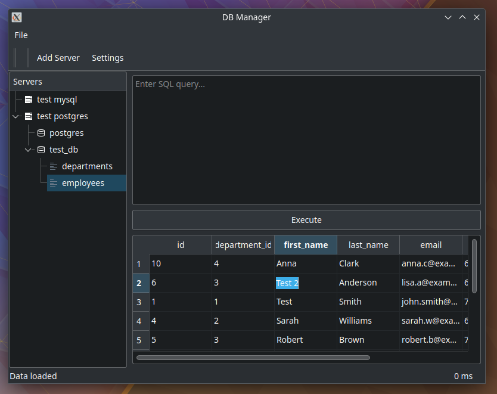

# db_manager

A simple Qt-based database management tool that supports MySQL and PostgreSQL connections.

## Features

* Multi-server connection management
* Tree-based navigation (Servers -> Databases -> Tables)
* Table data viewing and editing
* Custom SQL query execution
* Data sorting by columns
* Copy selected cells to clipboard
* Export data to CSV
* Transaction support for data modifications
* Server connection settings storage
* Dark theme support

